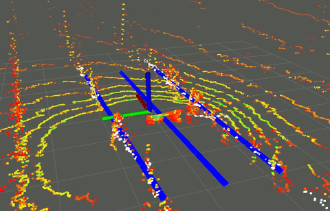

# Vineyard Row Middle Detection
ROS package for detecting the middle of the passage between the row of grapevines.

Point Cloud Library (PCL) is used to detect the border rows from a 3D LiDAR scan. 

## Installation

### Dependencies

PCL

### Build

Clone into a catkin workspace and build with

	catkin build viv_gazebo

## Usage

### Launching

To launch the node along with Rviz visualization:

	roslaunch vineyard_midrow_detection mid_row_detection.launch  

### Parameters
TODO

### Method

TODO 